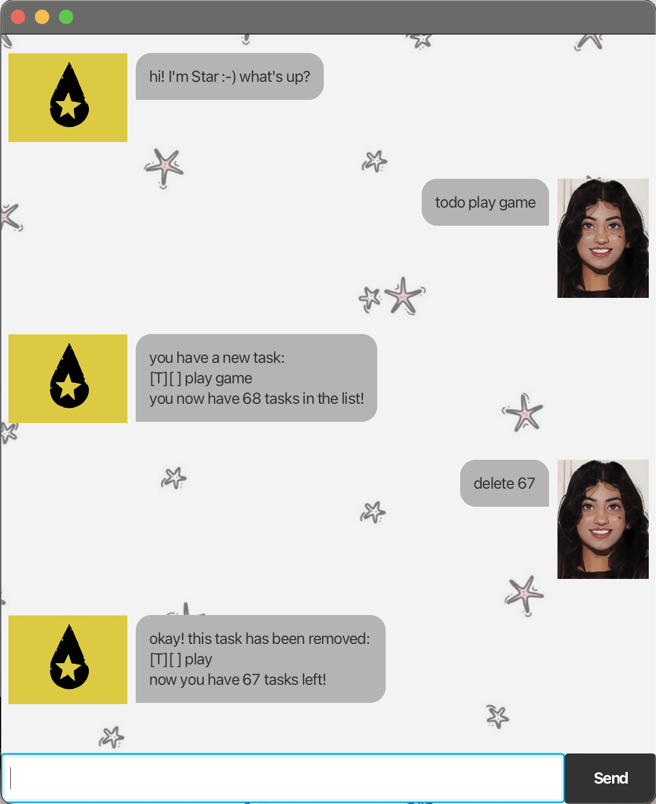
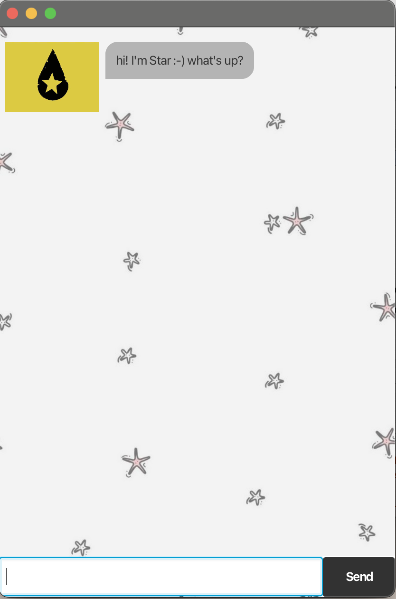
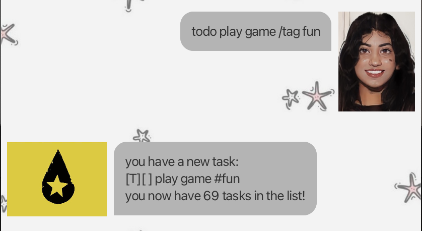
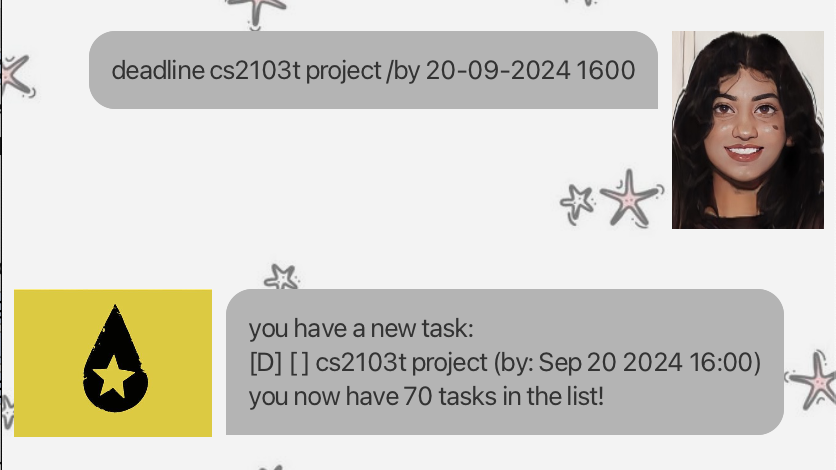
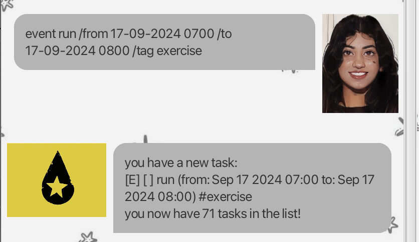
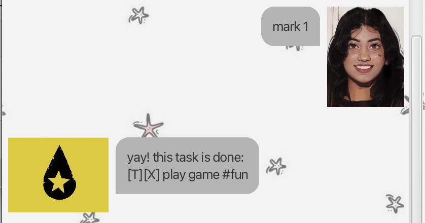
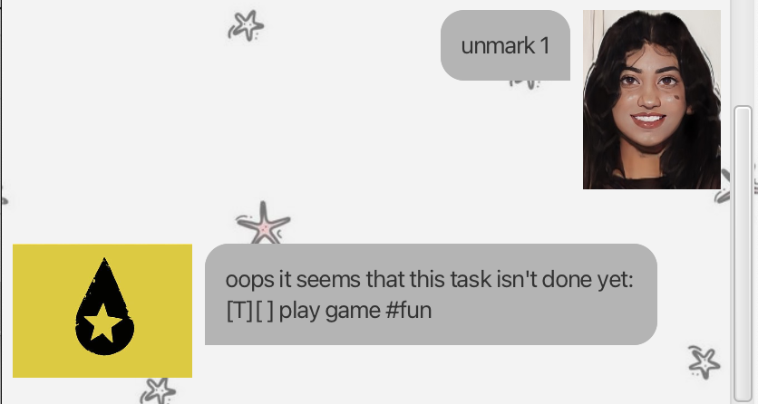
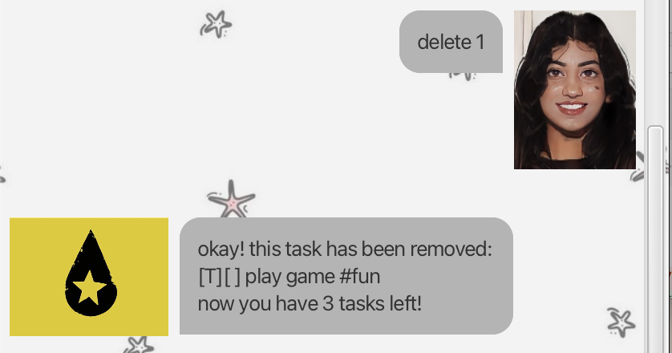
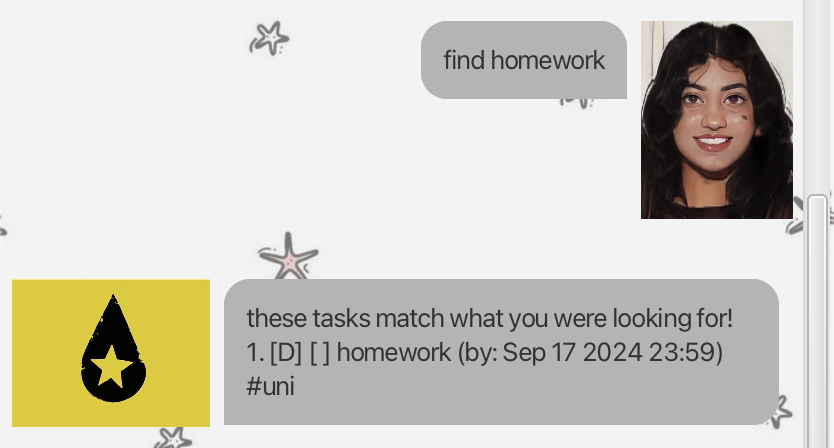
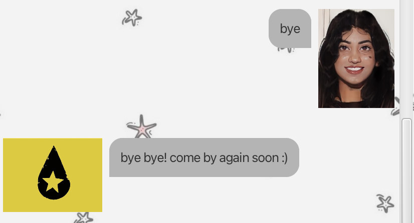

# Star User Guide ✮


## Star ⭐️
Star is a chatbot that manages your life for you so that YOU can live up to your ⭐️ potential! It can do SO much:

- [ ] manage your deadlines
- [ ] manage your todos
- [ ] manage your events

And there's more! It is incredibly fun to use because its:

- text-based
- simple to learn
- fast to use

Start using Star NOW!

1. download it from here
2. double-click it
3. add your tasks
4. sit back and watch it arrange everything for you 🤩

> Star, star, star, star, star, star - Mamushi by Megan Thee Stallion

You can also use this application to practise Java! Here's the main method:
```
public class Main {
    public static void main(String[] args) {
        Application.launch(Star.class, args);
    }
}
```

## Quick Start
1. Ensure you have Java 17 or above installed in your Computer. 
2. Download the latest .jar file from [here](https://github.com/yastsc/ip/releases).
3. Copy the file to the folder you want to use as the home folder for your Star.
4. Open a command terminal, cd into the folder you put the jar file in, and use the java -jar star.jar command to run the application.
5. A GUI similar to the below should appear in a few seconds.
   
6. Type the command in the command box and press Enter to execute it.
7. Refer to the [Features](#features) below for details of each command.

## Features
### Adding a Todo: `Todo`

Adds a Todo task with the given description and tag (if applicable).

Format: `todo <TASK DESCRIPTION> [/tag <TAG>]`

> [!TIP]
> A Todo task can have 1 or 0 tags. 

Examples:
- `todo play game /tag fun`
- `todo buy groceries`



### Adding a Deadline: `Deadline`

Adds a Deadline task with the given description, deadline date and time and tag (if applicable).

Format: `deadline <TASK DESCRIPTION> /by <DD-MM-YYYY HHmm> [/tag <TAG>]`

> [!TIP]
> A Deadline task can have 1 or 0 tags.

Examples:
- `deadline homework /by 17-09-2024 2359 /tag uni`
- `deadline cs2103t project /by 20-09-2024 1600`



### Adding an Event: `Event`

Adds a Event task with the given description, start date and time, end date and time and tag (if applicable).

Format: 
- `event <TASK DESCRIPTION> /from <DD-MM-YYYY HHmm> /to <DD-MM-YYYY HHmm> [/tag <TAG>]`
- `event <TASK DESCRIPTION> /at <DD-MM-YYYY HHmm> [/tag <TAG>]`

> [!TIP]
> An Event task can have 1 or 0 tags.

Examples:
- `event run /from 17-09-2024 0700 /to 17-09-2024 0800 /tag exercise`
- `event house karaoke /at 20-09-2024 1600`



### Listing all tasks: `list`

Shows a list of all the tasks currently in your task list.

Format: `list`


### Marking a task as done: `mark`

Marks the task with the given index in the task list as done.

Format: `mark <TASK INDEX IN LIST>`

> [!NOTE]
> Index given must be smaller than or equal to the number of tasks currently in your task list.

Examples:
- `mark 1`
- `mark 3`



### Unmarking a task as done: `unmark`

Unmarks the task with the given index in the task list to make it undone.

Format: `unmark <TASK INDEX IN LIST>`

> [!NOTE]
> Index given must be smaller than or equal to the number of tasks currently in your task list.

Examples:
- `unmark 1`
- `unmark 3`



### Deleting a task: `delete`

Deletes the task with the given index in the task list.

Format: `delete <TASK INDEX IN LIST>`

> [!NOTE]
> Index given must be smaller than or equal to the number of tasks currently in your task list.

Examples:
- `delete 1`
- `delete 3`



### Finding a task: `find`

Finds the task with the given keyword in the task list.

Format: `find <KEYWORD>`

Examples:
- `find buy`
- `find homework`



### Exiting Star: `bye`

Saves your tasks currently in the task list and exits Star.

Format: `bye`


